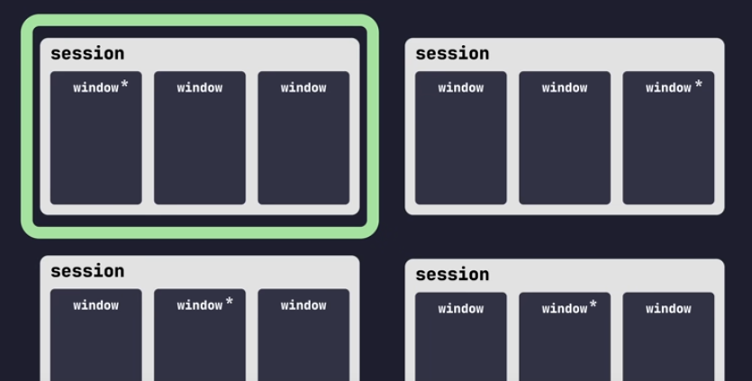
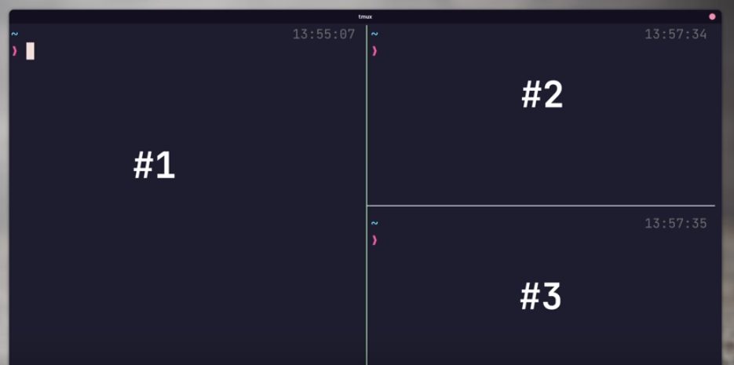

# tmux terminal multiplexer

Custom configuration that I use to improve my own productivity.

Followed tips from:
- https://www.youtube.com/watch?v=DzNmUNvnB04


## Install tools

Install [tmux](https://github.com/tmux/tmux/wiki/Installing)
> sudo apt install tmux

Install [xclip](https://github.com/astrand/xclip) for clipboard support
> sudo apt-get install xclip

Install [TPM](https://github.com/tmux-plugins/tpm) (Tmux Package Manager)
> git clone https://github.com/tmux-plugins/tpm ~/.tmux/plugins/tpm

Install nerd-font
> See https://github.com/JetBrains/JetBrainsMono for different OS.
```
mkdir ~/.fonts
cd ~/.fonts
wget https://github.com/ryanoasis/nerd-fonts/releases/download/v3.0.2/JetBrainsMono.zip

unzip JetBrainsMono.zip

Restart your terminal and go to preferences. Change the font to use in your profile

```

## Configure tmux

Copy the `tmux.conf` file in this repo into your local `$HOME/.tmux.conf`
> cp linux-config/tmux/tmux.conf $HOME/.tmux.conf

Run `tmux` and then `<prefix> + I` to install the plugins

## Quick Reference
Visit [tmux cheat sheet](https://tmuxcheatsheet.com/) for more details.  
*Note*: Enter "command mode" with \<prefix> + :

### Sessions
Sessions are the top layer in tmux and are a collection of one or more windows managed as single unit. 
You can have any number of sessions open at one time, but typically only attached to one. Each session has a single active window.
<!--  -->
> - **Create new session**: use the "new" command 
> - **List sessions**: \<prefix> + s  (or `tmux ls`)  
> - **Preview sessions**: \<prefix> + w  
> - **kill/delete Session**: tmux kill-session -t Number

### Windows
Windows are a container to one or more panes. We can think in windows as tabs in browsers.
Each window has a currently active pane and allows to swithc between any of the panes that it manages
> - **Create a new window**: \<prefix> + c  
> - **Change to window**: \<prefix> + Number    
> - **Change to window**: \<prefix> + [n|p] (next|previous)  
> - **Close current window**: \<prefix> + &  

### Panes
Panes are split in the window an represent and individual terminal session. There will be only one active pane at a time that you interact with.
<!--  -->

> - **Split horizontally**: \<prefix> + -  
> - **Split vertically**: \<prefix> + _  
> - **Navigate Panes**: \<prefix> + arrow_keys  
> - **Toggle Panels**: \<prefix> + q  
> - **Zoom into a Pane**: \<prefix> + z  
> - **Close Pane**: \<prefix> + x  

### Copy/Paste
The folowing shortcuts are the default ones but, when running on mouse mode, it will be enough with selecting the text.
> - **Enter copy mode**: \<prefix> + [  
> - **Start selection**: Space  
> - **Copy selection**: Enter  
> - **Paste selection**: \<prefix> + ]  
> - **Quit copy mode**: q  
